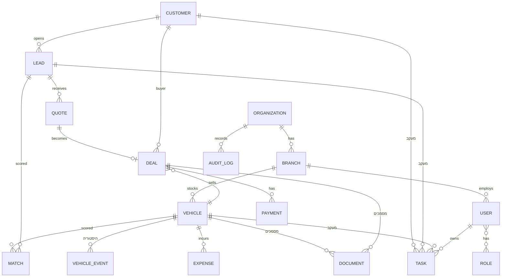

# מודל נתונים ו-ERD — שלב MVP

מסמך זה מכסה רק את הישויות הדרושות ל-MVP (ראו `architecture.md`). ישויות נוספות
מהמסמך המלא (Supplier/WorkOrder מתקדם, TradeIn, Consent/Communication מלאים וכו')
יתווספו כשיגיע שלב 2, ולא יבנו כרגע כדי לא לעכב את ה-MVP.

## דיאגרמת ישויות (ERD)

## ישויות ושדות ליבה

### Organization / Branch / User / Role
| ישות | שדות עיקריים |
|---|---|
| Organization | id, name, tax_settings (מע"מ), created_at |
| Branch | id, organization_id, name, address |
| User | id, branch_id (ברירת מחדל, אפשר גישה למספר סניפים), full_name, email, phone, password_hash, is_active, deleted_at |
| Role | id, name (בעלים/מנהל מכירות/איש מכירות/מנהל מלאי/תפעול/כספים/צופה) |
| UserRole | user_id, role_id, branch_scope (אופציונלי — הגבלה לסניף מסוים) |

### Vehicle
שדות ליבה ל-MVP (מתוך קבוצות השדות בסעיף 4.1 במסמך האפיון — לא כל שדה, רק מה שנדרש כדי
שהמלאי יעבוד end-to-end):

| קבוצה | שדות |
|---|---|
| זיהוי | id (פנימי, קבוע), license_plate, vin, manufacturer, model, sub_model, year |
| מאפיינים | mileage_km, color, body_type, fuel_type, gearbox, ownership_type |
| תמחור | purchase_price, accumulated_cost, target_price, min_approved_price, list_price |
| מצב ותפעול | status (ראו טבלת סטטוסים למטה), branch_id, location, intake_date, responsible_user_id |
| מדיה | photos[], documents (קישור ל-Document) |

**סטטוס רכב** (State Machine — מסעיף 4.2 במסמך האפיון, גרסה מצומצמת ל-MVP):
`candidate → intake → reconditioning → available → reserved → in_deal → sold → delivered`
(+ `cancelled`, `returned_to_supplier` כענפי יציאה). מעבר סטטוס הוא פעולה מתועדת ב-`VehicleEvent`
ו-`AuditLog`; אי אפשר לדלג ל-`available` בלי שדות חובה מלאים (מחיר, תמונה אחת לפחות).

### VehicleEvent (היסטוריה — Append-only)
id, vehicle_id, event_type, field_changed, old_value, new_value, actor_id, created_at.
טבלה זו לעולם לא נמחקת ולא מתעדכנת — רק נוספת אליה.

### Expense
id, vehicle_id, category (רכש/השבחה/הובלה/פרסום/אחר), amount, description, created_by, created_at.

### Customer / Lead
| ישות | שדות עיקריים |
|---|---|
| Customer | id, full_name, phone, email, city, marketing_consent, created_at |
| Lead | id, customer_id, source, status, owner_user_id, preferences (json: manufacturer/model/budget/…), next_action_date, created_at |

**סטטוס ליד:** `new → contacted → qualified → meeting → test_drive → offer → negotiation → won / lost / not_relevant / future_nurture`

### Match
id, lead_id, vehicle_id, score (0-100), explanation (json: מרכיבי הציון), created_at.

### Quote
id, lead_id, vehicle_id, price, discount, valid_until, status (`draft → sent → viewed → approved → rejected → expired`), version, created_by.
כל עריכה יוצרת רשומת Quote חדשה (גרסה) — אף פעם לא דורסים הצעה קודמת.

### Deal
id, quote_id, customer_id, vehicle_id, salesperson_id, sale_price, status
(`draft → pending_approval → signed → paid → ready_for_delivery → delivered → cancelled`),
version (Optimistic Locking).

**כלל מחייב:** אי אפשר לפתוח שתי עסקאות פעילות (לא `cancelled`) על אותו `vehicle_id` —
נאכף ברמת מסד הנתונים (unique constraint חלקי / בדיקת עסקה בתוך Transaction).

### Payment
id, deal_id, amount, method, reference, status, created_at.

### Document
id, entity_type, entity_id (פולימורפי — מקושר לרכב/לקוח/עסקה), doc_type, file_url,
version, is_locked (אחרי חתימה), uploaded_by, created_at.

### Task
id, entity_type, entity_id (פולימורפי), owner_user_id, type, due_at, priority, status
(`open → done / cancelled`), notes.

### AuditLog
id, entity_type, entity_id, actor_id, action, before (json), after (json), created_at.
נכתב אוטומטית על ידי כל endpoint שמשנה נתון רגיש (ראו `api-conventions.md`).

## מה נשאר פתוח
מילון נתונים מלא (כל שדה, טיפוס, חובה/אופציונלי, ולידציה) ייכתב תוך כדי בניית כל מודול —
לא כתרגיל תיאורטי מראש לכל 40 הסעיפים, כדי לא לתכנן שדות שישתנו לפני שנראה אותם בשימוש.
